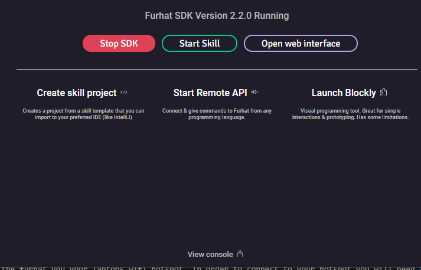
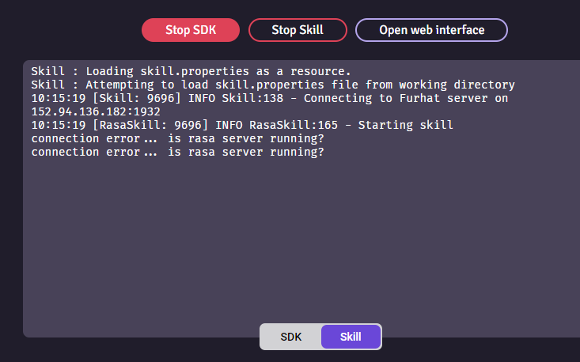

# How to run Webchat, furhat - virtual and physical - with screen


## Step 1
## Setting the IP-address of the rasa-server
Step 1 for everything is to enter the correct IP for the RASA server.
Normally when testing, you will use 'localhost' as your address.
If you are running over a different network, go to config-file and change IP

You change IP at the top of the file in question.
You change the IP in 
> dagfinn\ui\furhatScreen.index.js

and in

>dagfinn\ui\furhat-skills\rasa\src\main\kotlin\furhatos\app\rasa\flow.interaction.kt

```
const IP = "10.192.201.55"     // or  "localhost"
const PORT = "5005"
```

Remember to recompile after changing IP in `interaction.kt`

See 
[Making changes to the skill \ kotlin code](#making-changes-to-the-skill-|-kotlin-code)
## Step 2
## Starting RASA server(s)
In every case run rasa servers first. Make sure you are standing in the base project folder.
And that you are in the virtual environment (dagfinn)
> (dagfinn) dagfinn\


Before starting the bot and after every change we need to retrain the bot. This can be done with the command:
```
rasa train
```
To run the chatbot you will need two terminals.
The first one is for the *actions* server. You can start it by typing:

```
rasa run actions
```

In the second terminal you can start the Rasa server with all defined channels:
```
rasa run --cors "*"
```
## Step 3
## Running virtual furhat + furhatscreen
In order to run the virtual furhat you need to have downloaded the furhat virtual launcher.
Go to the following link, you need to LOGIN you access the site.
> https://furhat.io/downloads
> 
Choose the virtual launcher of your choice: Mac, linux, windows.

Start the launcher and start the SDK. Then press start skill. 
The skill will be located in `ui\furhatscreen`
The name of the skillfile is:
> rasa-all.skill

Now to virtual furhat should be running and connected to rasa.


## Step 3 (alternative)
## Running physical furhat + furhatscreen
Start the robot by pressing the on button, small button, not the big wheel button.
In order to connect to the furhat, your laptop needs to be on the same network.
#### Guest network
By default the furhat is on the guest-network on uis. Go to uis.no and get access to the guest network
> https://www.uis.no/en/student/wifi-network

Make sure you are actually connected to the guest-network.
Make sure that the config file points to the correct IP address. Are you running rasa on the laptop, the IP you enter in the config file is your laptop's IP. Usually something like `10.168.200.5`

#### Wifi Hotspot
You can connect the furhat you your laptops wifi hotspot. In order to connect to your hotspot you will need to connect a keyboard to the furhat in order to type the password to hotspot wifi.


## Running rasa webchat

## Running webservers
Open a new terminal. Change directory to 
> dagfinn\ui\webchat

or
> dagfinn\ui\furhatscreen

run the command
```python -m http.server <port> ```
You can also omit portnumber and the server will default to port 8000
```python -m http.server```
or 
```python -m http.server 9000 ```
in order to run the server on a different port. this can be necessary if you try to run multiple web servers.


## Making changes to the skill | kotlin code
#recompile

go to folder 

>ui\furhat-skills\rasa\


run

```
gradlew shadowJar
```

the furhat skill will be under 
>ui\furhat-skills\rasa\build\libs

and is named `rasa-all.skill`


If you make any changes to the kotlin code, you have to recompile with gradlew shadowJar.


## Troubleshooting
Always Press Stop SDK, to make sure the SDK stops gracefully.
View Console at the bottom of the screen to view the output from 



The furhat can't find the rasa server, or is otherwise unable to reach the netowork.
