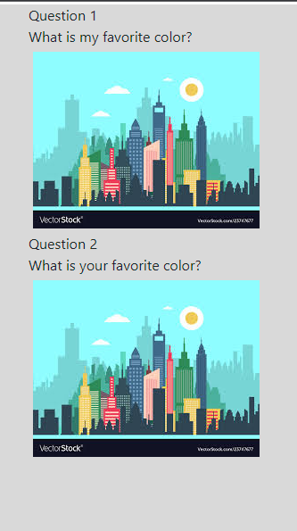

# Message protocol


> Focus on making it work in webchat
## Webchat

### In general
responses:
  utter_greet:
  - text: "Hey, {name}. How are you?"

{name}can be set programatically or can be taken from a slot.

dispatcher.utter_message(
    template="utter_greet",
    name="Sara"
)

## Conditionals
To specify repsonses to only be sent to the furhat, and not webchat you can apply a conoditional: <br /> `channel: furhat`

```
- text: Link to [Uis Homepage](https://uis.no)
- text: Visit UIS no
  channel: furhat
```

If no `channel: furhat` is present, responses will still be sent to furhat to be uttered. So normally you don't use this.
Only use this if you need to distinguish between webchat and furhat \ spoken.

### Links
``` 
text: Link to [Uis Homepage](https://uis.no) 
```
Issue: Since this is text, furhat will try to speak out the link.

To solve this you can use conditional statements:
```
- text: Link to [Uis Homepage](https://uis.no)
- text: Visit UIS no
  channel: furhat
```

This means the Visit UIS no will be spoken by the furhat, and appear at the furhatscreen, while the link will appear in the webchat.
### Emojis
Most Emojis work everywhere that can display text.
Check out this website to copy-paste some emojis.

 * https://emojipedia.org/


### Images
```
 utter_cheer_up:
  - text: "Here is something to cheer you up:"
    image: "https://i.imgur.com/nGF1K8f.jpg"
```
### Carousel
A carousel is a custom action that needs to be modified to your specific needs.
There is a action_quiz carousel basic template. 

So you will need to copy the template, register it as a new action, and fill in the response as you need. This example returns the name `action_quiz`.
Rename your new file, your class, and return name. The name returned, is the name you register in `domain.yml`
```
class ActionQuiz(Action):
    def name(self) -> Text:
        return "action_quiz"    

```
You should now be able to call this action, to serve a list. That works both for webchat and the furhatscreen.

The carousel will behave differently on furhatscreen and the webchat.
No interactivity on the furhatscreen, so no buttons.

### Furhatscreen




### Webchat


### Buttons
utter_greet:
  - text: "Hey! How are you?"
    buttons:
    - title: 😀
      payload: "mood_great"
    - title: "super sad"
      payload: "mood_unhappy"

Both carousel and buttons examples use intents as payloads. 
See https://rasa.com/docs/rasa/responses/#buttons for info on other payloads such as /inform

As with the carousel, no buttons are shown on the furhatscreen.

---
## Furhat Screen

### Maps
If maps are needed it should simply be an image. Any markers would be put on the map before saving the image.

---------------------------------------------
## Furhat

### Emojis
If you use emojis in responses, the furhat _should_ only allow alphanumerical values, 
e.g scrub any emojis from the text, and not try to pronounce emoji-names.

### Facial expressions
Make the furhat show emotions. 
Currently the furhat will raise eyebrows and smile as a default response.

Adding a custom data to the response with the following syntax will make the furhat show facial expressions.

```
utter_goodbye:
  - text: "Bye"
    custom:
      data:
        expression:
          expression_type: "anger"
```

These 5 facial expressions are currently supported.
- "anger" to Gestures.ExpressAnger,
- "shakehead" to Gestures.Shake,
- "nod" to Gestures.Nod,
- "wink" to Gestures.Wink,
- "surprise" to Gestures.Surprise


